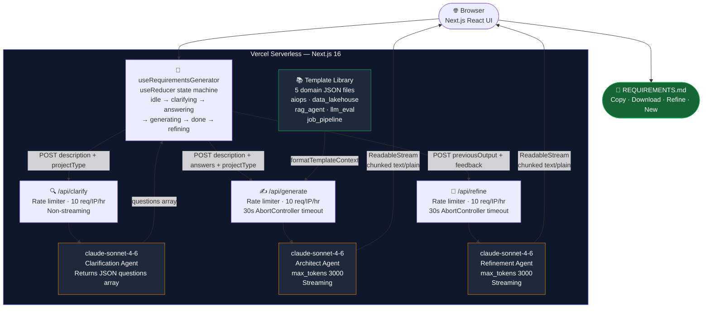

# ⚡ REQUIREMENTS Architect

<div align="center">

| 🤖 Two-Agent Pipeline | 📄 Output | ⚡ Live | 🔒 Rate Limited |
|:---:|:---:|:---:|:---:|
| Clarify → Architect → Refine | **REQUIREMENTS.md** | **Vercel Serverless** | 10 req / IP / hour |

**Generate production-grade `REQUIREMENTS.md` files for AI/ML projects in under 60 seconds.**

*Describe your project → answer 3–5 targeted questions → receive a fully structured requirements document — then refine it iteratively with plain-English feedback.*

[](https://requirements-architect.vercel.app)
[](https://nextjs.org)
[](https://anthropic.com)
[](https://www.typescriptlang.org)

</div>

---

## 🚀 Live Demo

The app is **live and free to use** — no account, no API key, no setup:

**[https://requirements-architect.vercel.app](https://requirements-architect.vercel.app)**

Or call the API directly:

```bash
# Step 1 — Get clarification questions
curl -X POST https://requirements-architect.vercel.app/api/clarify \
  -H "Content-Type: application/json" \
  -d '{
    "description": "Build a RAG agent that ingests PDF documents, chunks them semantically, stores embeddings in ChromaDB, and answers user questions with citations using Claude Sonnet.",
    "projectType": "rag_agent"
  }'

# Response:
{
  "questions": [
    "What document types and volumes will the system handle?",
    "What latency and concurrency requirements do you have?",
    "Which retrieval quality dimensions matter most — precision, recall, or citation accuracy?",
    "What is your deployment target — cloud, on-prem, or local?",
    "What is your monthly cost ceiling for LLM and embedding calls?"
  ]
}
```

```bash
# Step 2 — Stream the REQUIREMENTS.md
curl -X POST https://requirements-architect.vercel.app/api/generate \
  -H "Content-Type: application/json" \
  -d '{
    "description": "Build a RAG agent that ingests PDF documents ...",
    "projectType": "rag_agent",
    "answers": [
      "PDFs only, up to 500 pages each, ~100 documents",
      "Sub-2s retrieval, 10 concurrent users",
      "Citation accuracy is paramount",
      "AWS, budget under $50/month",
      "$30/month hard cap on LLM calls"
    ]
  }' --no-buffer
```

```bash
# Step 3 — Refine the generated document
curl -X POST https://requirements-architect.vercel.app/api/refine \
  -H "Content-Type: application/json" \
  -d '{
    "previousOutput": "# REQUIREMENTS.md\n...",
    "feedback": "Switch deployment from AWS ECS to Docker Compose for local-first operation. Add Redis as a caching layer in the architecture decisions."
  }' --no-buffer
```

---

## ⚡ Business Value

| Without REQUIREMENTS Architect | With REQUIREMENTS Architect |
|---|---|
| Engineer spends 2–4 hours writing requirements from scratch | **Complete REQUIREMENTS.md in < 60 seconds** |
| Stack choices made ad-hoc without documented rationale | **Every technology choice has an explicit rationale** |
| Phases and milestones undefined until sprint planning | **Phase structure with deliverables defined upfront** |
| Cost model unknown until first AWS bill | **Cost estimate with per-component breakdown included** |
| Architecture decisions undocumented, re-litigated in every meeting | **ADRs embedded in the document from day one** |
| Generic template doesn't know AIOps from a RAG agent | **5 domain-specific templates calibrate the output** |
| Revisions require starting from scratch or manual editing | **Iterative refinement via plain-English feedback** |

---

## 🏗️ Architecture

### Three-Agent Pipeline

```
                        ┌────────────────────────────────────────────┐
  Browser               │     Next.js 16 App — Vercel Serverless     │
  (React UI)            │                                            │
                        │   ┌────────────────────────────────────┐  │
  1. Describe ─────────►│   │  /app/page.tsx                     │  │
     project            │   │  useRequirementsGenerator()        │  │
                        │   │  useReducer state machine          │  │
                        │   │  idle→clarifying→answering         │  │
                        │   │    →generating→done→refining       │  │
                        │   └──────────┬─────────────────────────┘  │
                        │              │                             │
                        │   ┌──────────▼─────────────────────────┐  │
  2. Questions ◄────────│   │  POST /api/clarify                 │  │
     (3–5 items)        │   │  Rate limit · Non-streaming        │  │
                        │   │  claude-sonnet-4-6                 │  │
                        │   └──────────┬─────────────────────────┘  │
                        │              │                             │
  3. Answers ──────────►│   ┌──────────▼─────────────────────────┐  │
                        │   │  POST /api/generate                │  │
                        │   │  Rate limit · 30s timeout          │  │
                        │   │  Template injection                │  │
                        │   │  claude-sonnet-4-6 · Streaming     │  │
                        │   └──────────┬─────────────────────────┘  │
                        │              │                             │
  4. Streaming ◄────────│   chunked text/plain                       │
     markdown           │   Copy · Download · Refine · New           │
                        │                                            │
  5. Feedback ─────────►│   ┌──────────────────────────────────┐    │
     (optional)         │   │  POST /api/refine                 │    │
                        │   │  Rate limit · 30s timeout         │    │
                        │   │  previousOutput + feedback        │    │
                        │   │  claude-sonnet-4-6 · Streaming    │    │
                        │   └──────────────────────────────────┘    │
                        │                                            │
  6. Revised doc ◄──────│   chunked text/plain (full revised doc)    │
                        └────────────────────────────────────────────┘
```

### Mermaid Diagram



### Request Flow Detail

1. **User describes** their project and selects a project type from 6 options
2. **Clarification Agent** (claude-sonnet-4-6, non-streaming) returns 3–5 targeted questions as a JSON array
3. **User answers** each question in the form
4. **Template injection** — `formatTemplateContext()` loads the matching JSON template and injects it into the architect prompt
5. **Architect Agent** (claude-sonnet-4-6, streaming) streams a complete `REQUIREMENTS.md` with the current date injected
6. **Output** streams token-by-token to the browser via `ReadableStream` + chunked transfer encoding
7. *(Optional)* **User clicks Refine** — enters plain-English feedback describing what to change
8. **Refinement Agent** (claude-sonnet-4-6, streaming) receives the existing document + feedback, applies targeted changes, and streams the complete revised document

---

## 💼 Why This Matters

| Capability | How It's Delivered |
|---|---|
| **Iterative refinement** | After generation, a "Refine ✎" button opens a feedback panel — describe what to change and the full revised document is streamed back |
| **Domain-calibrated output** | 5 JSON templates (AIOps, Data Lakehouse, RAG Agent, LLM Eval, Job Pipeline) inject project-specific stack defaults and architecture decisions |
| **Two-agent separation of concerns** | Clarification Agent focuses only on what to ask; Architect Agent focuses only on writing |
| **Cost transparency** | Every generation logs actual input/output tokens and estimated cost; displayed in the UI after generation |
| **Production hardening** | Rate limiter (10 req/IP/hour), 30s AbortController timeout on all Anthropic calls, React ErrorBoundary, input validation on all routes |
| **Zero infrastructure** | Fully stateless — no database, no auth, no session store |
| **Streaming UX** | Token-by-token streaming with scroll-to-bottom, copy-to-clipboard, and download |

---

## 🧰 Tech Stack

| Layer | Technology | Notes |
|---|---|---|
| **Framework** | Next.js 16 (App Router) | TypeScript strict mode, serverless API routes |
| **Styling** | Tailwind CSS v4 | Utility-first, zero runtime CSS |
| **LLM — Clarification** | claude-sonnet-4-6 | Non-streaming, JSON array output, ~5–10s |
| **LLM — Architect** | claude-sonnet-4-6 | Streaming, max 3000 output tokens, ~30s |
| **LLM — Refinement** | claude-sonnet-4-6 | Streaming, previous doc + feedback → revised doc |
| **Anthropic SDK** | `@anthropic-ai/sdk ^0.90` | `messages.stream()` with AbortSignal |
| **Markdown** | react-markdown + remark-gfm + rehype-highlight | GFM tables, streaming-safe, no dangerouslySetInnerHTML |
| **State management** | `useReducer` | 7-state machine: idle→clarifying→answering→generating→done→refining\|error |
| **Rate limiting** | In-memory Map | 10 req/IP/hour, window-based, applied to all 3 routes |
| **Deployment** | Vercel (free tier) | `maxDuration: 60` on generate and refine routes |

---

## 🗂️ Project Templates

Five built-in templates calibrate the Architect Agent's output for specific project types.

| Template | Project Type | Key Technologies Injected |
|---|---|---|
| **AIOps Triage** | `aiops` | Kafka, Haiku Batch, Sonnet, LangGraph, PagerDuty, SQLite→PG, Prometheus |
| **Data Lakehouse** | `data_lakehouse` | Airflow, Delta Lake, dbt, DuckDB, Great Expectations, medallion architecture |
| **RAG Agent** | `rag_agent` | ChromaDB, text-embedding-3-small, LangGraph, FastAPI, hybrid retrieval (BM25+dense+RRF) |
| **LLM Eval Framework** | `llm_eval` | Sonnet-as-judge (pinned), Haiku Batch, git-tracked prompt versioning by SHA, regression detection |
| **Job Search Pipeline** | `job_pipeline` | python-jobspy, two-layer dedup (hash+ChromaDB), Haiku Batch Tier A, Sonnet Tier B (20-listing cap) |
| **Custom** | `custom` | No template — pure model knowledge |

---

## 📂 Project Structure

```
requirements-architect/
├── app/
│   ├── page.tsx                    # Wizard UI — 7-state machine rendering
│   ├── layout.tsx                  # Root layout — OG tags, Geist font, highlight.js CSS
│   └── api/
│       ├── clarify/route.ts        # Clarification Agent — POST, rate-limited, JSON output
│       ├── generate/route.ts       # Architect Agent — POST, rate-limited, streaming, 30s timeout
│       └── refine/route.ts         # Refinement Agent — POST, rate-limited, streaming, 30s timeout
├── components/
│   ├── DescriptionInput.tsx        # Textarea + char counter + project type badge pills
│   ├── ClarificationForm.tsx       # Per-question textareas, back button, submit guard
│   ├── MarkdownRenderer.tsx        # react-markdown + remark-gfm + copy/download/refine toolbar
│   ├── RefinementInput.tsx         # Feedback textarea + submit/cancel — shown below output
│   ├── GenerationStats.tsx         # Time · tokens · cost · model label
│   └── ErrorBoundary.tsx           # React class component — catches MarkdownRenderer errors
├── hooks/
│   └── useRequirementsGenerator.ts # useReducer state machine + streaming fetch + retry + refine
├── lib/
│   ├── anthropic.ts                # Singleton Anthropic client
│   ├── prompts.ts                  # buildArchitectPrompt() — injects current date + template context
│   ├── rateLimit.ts                # In-memory Map rate limiter (10 req/IP/hour)
│   ├── types.ts                    # WizardState, ProjectType, GenerateRequest, RefineRequest types
│   └── templates/
│       ├── index.ts                # formatTemplateContext() — loads + formats JSON templates
│       ├── aiops_triage.json
│       ├── data_lakehouse.json
│       ├── rag_agent.json
│       ├── llm_eval.json
│       └── job_pipeline.json
├── prompts/
│   ├── clarification_agent.txt     # Clarification system prompt — JSON array output only
│   └── architect_agent.txt         # Architect system prompt — full REQUIREMENTS.md format spec
├── .env.local                      # ANTHROPIC_API_KEY — never committed
├── CLAUDE.md                       # Claude Code session context
└── REQUIREMENTS.md                 # Project specification (dogfooded — generated by this app)
```

---

## ✅ Pros & Cons

### Pros

| | Benefit |
|---|---|
| ⚡ | **Instant bootstrap** — generates a complete, opinionated REQUIREMENTS.md in under 60 seconds |
| 🔄 | **Iterative refinement** — describe what to change in plain English; the full revised document streams back without re-entering the form |
| 🧠 | **Domain knowledge built in** — templates encode real architectural decisions for AIOps, RAG, data engineering, and ML evaluation workflows |
| 💸 | **Cost-transparent** — every generation shows actual token count and estimated cost |
| 🔒 | **No data retention** — fully stateless; nothing is stored beyond the server response |
| 🛠️ | **Editable output** — download and modify as the project evolves |
| 🔁 | **Retry without re-answering** — one-click retry replays the same parameters |
| 🌐 | **Zero setup for end users** — live on Vercel, no account required |

### Cons

| | Limitation |
|---|---|
| 🧠 | **Model knowledge cutoff** — stack recommendations reflect training data; very new frameworks may not be well-represented |
| 📏 | **3,000 token output cap** — complex projects may have sections compressed; the cap is a cost guard |
| 🔄 | **Stateless by design** — no history or versioning; closing the tab loses the output (use Download) |
| ⏱️ | **~30s generation time** — Vercel cold starts + Sonnet streaming |
| 🔀 | **Non-deterministic** — same inputs produce similar but not identical outputs across runs |
| 🌐 | **Rate limited** — 10 requests per IP per hour across all three routes |
| 📋 | **Not a project manager** — generates requirements, not sprint plans, tickets, or Gantt charts |

---

## 🔬 Cost Model

| Component | Model | Tokens (typical) | Cost per call |
|---|---|---|---|
| Clarification Agent | claude-sonnet-4-6 | ~800 input / ~200 output | ~$0.005 |
| Architect Agent | claude-sonnet-4-6 | ~2,000 input / ~2,500 output | ~$0.044 |
| Refinement Agent | claude-sonnet-4-6 | ~5,000 input / ~2,500 output | ~$0.053 |
| **Full flow (generate + one refine)** | | | **~$0.10** |

Pricing: Sonnet input $3/M tokens · output $15/M tokens.

At 200 generate + 100 refine calls/month: **~$14/month**.

---

## ⚙️ Local Development

### Prerequisites
- Node.js 18+
- An [Anthropic API key](https://console.anthropic.com/)

### Setup

```bash
git clone https://github.com/DevMLAI01/requirements-architect.git
cd requirements-architect
npm install
```

Create `.env.local`:

```bash
ANTHROPIC_API_KEY=sk-ant-...
```

```bash
npm run dev
# Open http://localhost:3000
```

### Environment Variables

| Variable | Required | Description |
|---|---|---|
| `ANTHROPIC_API_KEY` | ✅ Yes | Your Anthropic API key — never commit this |

### Deploy to Vercel

```bash
npm install -g vercel
vercel --prod
```

Add the API key:

```bash
vercel env add ANTHROPIC_API_KEY production
```

To enable automatic deploys on every `git push`, connect your GitHub repo under **Vercel → Settings → Git**.

---

## ⚠️ Known Limitations

- **Rate limiter is in-memory** — resets on Vercel cold start; the 10 req/hour limit is best-effort, not cryptographically enforced
- **No output persistence** — generated documents exist only in the browser tab; closing the tab loses them (use Download)
- **Vercel free tier cold starts** — first request after inactivity may take 5–10s before the first token appears
- **Refinement token budget** — the previous document is sent as input to the refine route, consuming ~3,000–4,000 input tokens before the model writes a single output token

---

## 📄 License

This project is provided for educational and portfolio purposes.

---

<div align="center">

Built with 🏗️ by [DevMLAI01](https://github.com/DevMLAI01) · Powered by [Claude Sonnet 4.6](https://anthropic.com)

</div>
